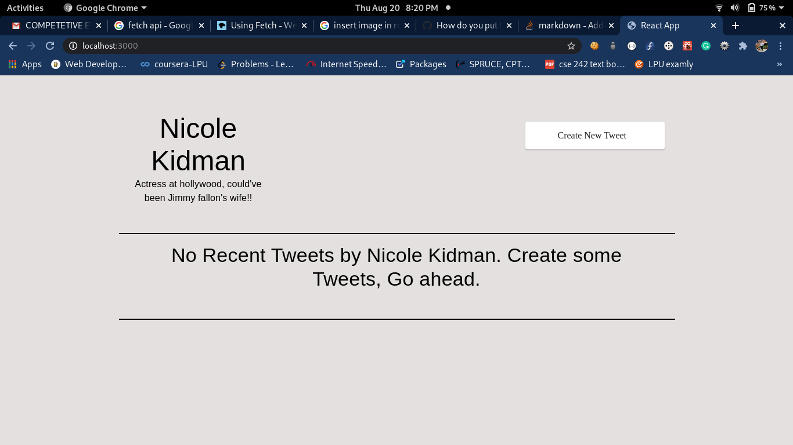

After cloning or downloading the repo, cd into the directory, run,
```npm install```
to install all the required dependencies.

Then run 
```npm start```

to start the local server.

Screenshots of the feature:
Screenshot 1:

Screeenshot 2:

Screenshot 3:

